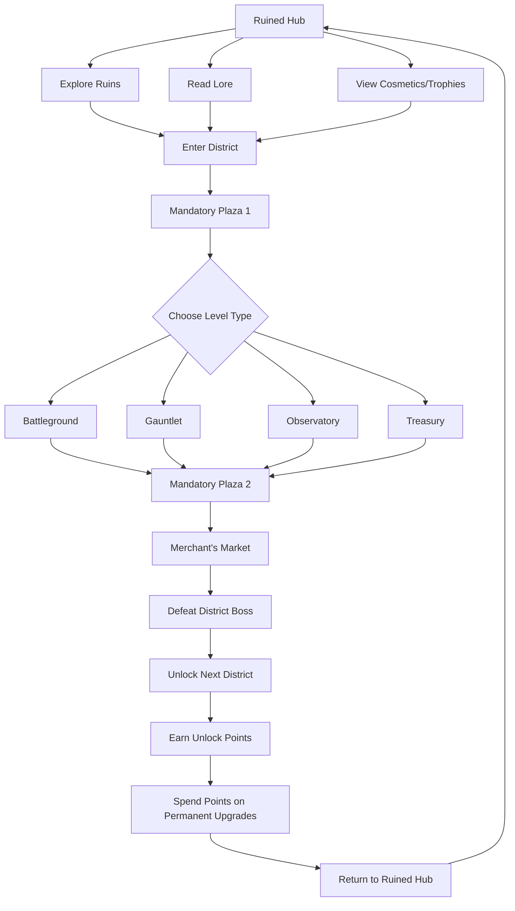

# Tomebound – Game Design Document

## 1. Introduction

**Tomebound** is a co-op (or single-player 😢) *roguelite* for fans of **dungeon crawlers** and **puzzle games** alike.

> **Roguelite** – a game with procedurally generated runs, permadeath, and meta progression via classes, upgrades, or unlocks.
> **Dungeon Crawler** – a game where you explore dungeons, fight enemies, and collect loot.
> **Puzzle Game** – a game where you prove you're smarter than a locked door.

---

### 1.1 Game Synopsis

Two rival lizard wizards snuck into a lost city to steal a magic book—only to be cursed by it.

Now trapped in a time-looping, reality-warping labyrinth, they must work together to fight, puzzle, and portal their way to freedom.

Each run through **The Lost City** and its **Districts of Dawn, Dusk, Midday, and Midnight** offers a randomized path of levels. At every crossroads, your choices define the journey—**Battlegrounds** that forge your brutality, **Gauntlets** that test your endurance, **Observatories** that challenge your intellect, **Treasuries** that tempt you with riches, and the **Merchant**, who happily trades fortune for firepower.

As you tackle these level types, you shape your run’s evolving identity. Temporary upgrades push your wizards toward distinct strategies, while the treasure you collect fuels powerful buffs at the **Merchant’s Market**.

At the end of each district, a **boss** awaits. If you’ve planned well, your wizard lizards will triumph. If not, the Tome’s curse takes hold—time snaps back, and your run begins anew.

Victory unlocks the next district permanently and earns you valuable unlock points to invest in permanent character upgrades that reshape future runs. Return to previously-mastered chambers for better loot, new skills, or just to flex your speed-clearing skills.

---

### 1.2 Level Types

| **Level Type**            | **Description**                                                                                                                                                               |
| ------------------------- | ----------------------------------------------------------------------------------------------------------------------------------------------------------------------------- |
| **Plazas**                | Core levels in a run. Cooperate to uncover hidden runes and arrange them in the correct sequence to unlock the Runegate. Mixes puzzles, platforming, combat, and time trials. |
| **Battlegrounds**         | Pure combat-focused challenges. Successfully completing them rewards upgrades in the *Brutality* skill tree.                                                                  |
| **Gauntlets**              | Parkour/platforming-focused. Timed obstacle courses rewarding upgrades in the *Survivalist* skill tree.                                                                       |
| **Observatories**         | Puzzle-based levels filled with brainteasers and logic challenges. Rewards upgrades in the *Thinking Really Hard* skill tree *(final name TBC)*.                              |
| **Treasuries**            | Grab as much treasure as you can before time runs out. No power-ups here—just cold, hard cash.                                                                                |
| **The Merchant’s Market** | A shop space. Spend your treasure on run-specific upgrades, if they’re in stock.                                                                                              |

---

### 1.3 Core Gameplay Structure

Tomebound is a roguelite built around **two protagonists**.

* In **co-op**, each player controls one character.
* In **single-player**, both are controlled in real-time, with instant character switching.

Each run presents a procedurally generated path through varied level types (combat, platforming, puzzle-solving). Player choices shape the run's direction, allowing them to emphasize their strengths or explore new strategies. Upgrades rewarded from the different level types are always single use, meaning you can decide which of the wizard lizards recieves the offered buff - allowing for symetrical/asymetrical builds based on what your solo run or co-op team needs to succeed.

Each **district concludes with a boss fight**, presenting a consistent challenge regardless of the path taken.

---

### 1.4 Four Design Pillars

Everything designed for *Tomebound* must serve at least one of these four pillars. Anything that doesn’t is out-of-scope.

#### **1. Player-Directed Variety**

> *"The game shapes to the player, not the other way around."*

Players guide the structure of each run by selecting level types. Whether focused on combat, puzzles, platforming, or a mix, every run feels tailored and dynamic.

#### **2. Dual-Character Synergy**

> *"Two lizards, one brain—or two."*

Whether solo or co-op, synergy between the characters is key. Builds, abilities, and tactics are designed to encourage coordination and cooperation.

#### **3. Balanced Challenge Across Disciplines**

> *"Combat tests your reflexes. Puzzles test your reasoning. Platforming tests your control."*

Each skill domain plays a crucial role. Success depends not on specializing in one area, but on building mastery in your chosen route.

#### **4. Modular Progression & Replayability**

> *"Every choice builds toward something lasting."*

Each run grants temporary upgrades and earns unlock points for permanent progression. Failure is part of learning; success opens new paths and possibilities.

---

### 1.5 Intended Audience

*Tomebound* is designed for players who enjoy:

* Roguelites with meaningful progression and replayability
* Co-op or single-player experiences with character-driven mechanics
* Games that balance combat, platforming, and puzzle-solving
* Stylized, whimsical, or fantastical worlds with light narrative hooks
* Player agency and adaptable gameplay structure

**Inspirational Titles:** *Hades*, *Portal 2*, *Cult of the Lamb*, *Dead Cells*, *It Takes Two*
Aimed at both casual co-op fans and dedicated roguelite players.

---

### 1.6 Target Platforms

#### **Primary Launch Platform**

* **PC (Steam)** – Full-feature launch with single-player and couch co-op.

#### **Secondary Platforms (Post-Launch, Conditional on Success)**

* **Xbox Series X|S** – Potential Game Pass integration
* **PlayStation 5** – Potential PS Plus/Now support

#### **Tertiary Platform (Long-Term Goal)**

* **Nintendo Switch** – Conditional on performance and UX validation, with special attention to UI scaling and co-op experience.

> Platform priorities are based on development efficiency, market reach, and technical feasibility, with the **PC version as baseline** for all features and balance.

---

### 1.7 Document Scope & Team Usage

This Game Design Document supports cross-functional collaboration across the full development cycle.

* **Designers**: Align mechanics, levels, and features with the core gameplay loop and design pillars.
* **Programmers**: Reference systems, rules, and interaction models for implementation.
* **Artists**: Draw from the narrative and level design sections for tone and theme.
* **Writers**: Use tone guidance, bios, and narrative structure to shape storytelling.
* **QA/Testers**: Understand intended behaviors, system limits, and player expectations.

> Each section is modular and should evolve with the project. Ownership is assigned by discipline leads.

---

## 2. Gameplay Overview

## **2.1 – District Progression & Structure**

The game progresses through four districts, each representing a phase of the cursed expedition through **The Lost City**. The districts unfold chronologically, following the lizard wizards' journey from their initial intrusion to their ultimate escape.

---

### **Districts Overview**

* **Midday**
  The starting point. The curse has already taken hold. This district reflects the earliest phase of the expedition, when the city still seems partially intact and its challenges are familiar.

* **Dusk**
  As daylight fades, so does the stability of the world. Enemies grow stranger, puzzles become more abstract, and the environment grows increasingly warped.

* **Midnight**
  The deepest descent. This is the heart of the curse’s power—an unstable, hostile space of shifting reality and heightened difficulty.

* **Dawn**
  The final challenge. After surviving the night, the lizards push toward escape. The environment lightens, but the trials intensify—this is the district of resolution and rebirth.

---

### **District Structure**

Each district:

* Contains **procedurally generated paths** of level types:

  * **Plazas** (core progression)
  * Optional detours: **Battlegrounds**, **Gauntlets**, **Observatories**, **Treasuries**, **The Merchant Market**

* Concludes with a **district-specific boss encounter**

* Becomes **permanently unlocked** once completed

* Grants **unlock points** used for meta-progression and expanding future build options

---

## 2.2 Gameplay Breakdown

### 2.2.1 Combat

Combat in *Tomebound* emphasizes **movement**, **spacing**, and **reactive timing**. Attacks are **deliberately paced**, rewarding precision and commitment over button-mashing. Encounters are often **wave-based**, requiring players to manage enemies, terrain, and each other’s positioning.

---

#### Core Moveset

* **Three-Hit Melee Combo**

  * Light chaining with generous timing
  * Progressive base damage increase
  * Final hit has increased damage and knockback but slower recovery

* **Dash / Dodge Roll** *(Omni-directional)*

  * Grants invulnerability during off-the-ground frames
  * Used for spacing, repositioning, or disengaging

* **Dash Attack** *(High-impact movement attack)*

  * Single hit with high base damage
  * Chance to critically strike
  * Long recovery time

* **Jump Attack** *(Vertical slam)*

  * Single hit with chance to stun
  * Useful for initiating or disrupting enemies
  * Long recovery time

---

#### Battleground Example

> **Scenario:** Enter an enclosed arena.

* Enemies spawn in escalating waves
* **Survive for 60 seconds** to unlock exit *(Basic reward)*
* **Stay longer** to earn better rewards:

  * **Rare:** 90 seconds
  * **Epic:** 200 seconds

---

#### Example Brutality Upgrades

* Increased crit chance
* Increased stun chance
* Area of Effect (AoE) radius
* Lingering damage effects (burn, poison, etc.)
* Faster attack and recovery speed

---

#### Reward Tier Examples

| **Tier**  | **Stat Boosts**                                    | **Notes**                                                                                                      |
| --------- | -------------------------------------------------- | -------------------------------------------------------------------------------------------------------------- |
| **Basic** | +2–3% to stats (damage, crit rate, AoE size, etc.) | —                                                                                                              |
| **Rare**  | +7–10% to stats                                    | —                                                                                                              |
| **Epic**  | +15–20% or ×2.5 on stat                            | Includes a temporary **+10% boost** for next 5 encounters — great risk/reward if you're about to face the boss |

---

## **2.2.2 – Platforming & Traversal**

Platforming in *Tomebound* emphasizes **timing, spatial awareness, and recovery under pressure**. These sequences are designed to add tension, reward clean movement, and create visual rhythm between combat and puzzle segments. Players must navigate hazards, moving terrain, and traversal puzzles while under light time pressure.

While the game uses a **3D isometric perspective**, movement is tightly controlled in **2D space**, with stylized animations supporting clarity over hyper-realistic motion.

---

### **Core Movement Mechanics**

* **Run / Walk**
  Base movement with tuned acceleration and deceleration. Momentum allows for short sprints and intentional directional shifts.

* **Jump**
  Standard arc with variable height based on press duration. Used for clearing gaps, navigating hazards, and chaining through vertical layouts.

* **Wall Climb (Vines, Ladders, Surfaces)**
  Certain surfaces are climbable, allowing vertical traversal and alternate paths. No ledge-grabbing or auto-clambering; movement remains clean and stylized.

* **Dodge Roll (Aerial)**
  Dodge roll can be triggered midair to **cancel fall damage** or **recover momentum**, rewarding clutch reflexes and route awareness. Also useful for slipping past traps or reorienting during jumps.

---

### **Gauntlet Gameplay Example**

**Gauntlets** are traversal-focused challenge levels that test the player’s ability to move through hazardous environments efficiently.

* Enter a timed gauntlet featuring environmental hazards such as spike traps, moving platforms, collapsing floors, and other traversal challenges.
* Complete the course to unlock the exit.
* **Faster completion times** grant better rewards, encouraging mastery and precision.

| Time to Complete  | Reward Tier |
| ----------------- | ----------- |
| Under 200 seconds | **Basic**   |
| Under 120 seconds | **Rare**    |
| Under 60 seconds  | **Epic**    |

> *Note: Final timing thresholds may vary slightly depending on level layout and difficulty tuning.*

---

### **Example Survivalist Upgrades**

Survivalist upgrades improve a character’s **resilience and recovery**, helping them survive longer in high-pressure situations.

* Increased **maximum health**
* Increased **defense / damage resistance**
* Chance to **auto-block** one incoming hit every few seconds
* **Movement speed** boost
* **Dodge roll cooldown** reduced

---

### **Reward Tier Effects**

| Tier  | Stat Boost Example                    | Bonus Effect (Epic only)                       |
| ----- | ------------------------------------- | ---------------------------------------------- |
| Basic | +2–3% to health, defense, speed, etc. | —                                              |
| Rare  | +7–10% stat increase                  | —                                              |
| Epic  | +15–20% or **x2.5 multiplier**        | Temporary **+2 HP/sec regen** for next 5 rooms |

Epic-tier upgrades provide a **short-term regen bonus** to support recovery between encounters—especially valuable before boss fights or extended traversal sections.

---

## **2.2.3 – Puzzle Gameplay**

Puzzle encounters in *Tomebound* emphasize **observation, logic, and teamwork**. These segments provide structured cerebral challenges that require input and coordination from **both lizard wizards**—whether in co-op or single-player switching.

**All puzzles require two-character interaction**, through timing, positioning, or sequencing. Even basic mechanics like pressure plates or rune inputs demand cooperation and strategic thinking.

Outside of the regular Runegate that must be completed in every Plaza; other puzzles occasionally appear within **Plazas** to reveal interesting lore elements or collectibles. However, only puzzles encountered in **Observatories** award Intellect-based upgrades. These rooms are focused entirely on **mechanical mastery** and do not contain lore or narrative elements.

---

### **Core Puzzle Interaction Mechanics**

* **Rune Discovery and Sequencing**
  Uncover hidden glyphs throughout the environment and activate them in the correct order to open Runegates or unlock exits.

* **Pattern Recognition**
  Identify matching symbols, repeating paths, or environmental tells to complete ancient mechanisms.

* **Pressure Plates & Weighted Switches**
  Require both characters to act in tandem—either simultaneously or in a specific sequence—to unlock doors, reveal new puzzle elements, or shift room states.

* **Circuit Puzzles / Magical Flow**
  Redirect magical energy through rotating sigils, beam reflectors, or arcane nodes—often requiring coordination to align paths correctly.

* **Logic Problems**
  Simple tasks layered with constraints (e.g., only one character can move at a time, objects must be kept separate), turning them into multi-step puzzles.

* **Deduction Challenges**
  Classic reasoning puzzles, such as "one door leads to death, the other to escape," requiring players to extract truth from environmental clues or contradictory rules.

---

### **Observatory Gameplay Example**

> **Scenario:** Enter a sealed puzzle chamber with no enemies.

The room presents a logic- or coordination-based puzzle that must be solved through experimentation, planning, and collaboration.

**Performance is judged by efficiency**, not speed. Each puzzle room includes a **reset mechanism**. Using it restarts the chamber and clears all progress - useful for recovery, but it reduces your reward tier. Mistakes (e.g., false glyphs, incorrect switches, broken sequences) are also tracked.

---

#### **Performance-Based Reward Tiers**

| Criteria                                                | Reward Tier |
| ------------------------------------------------------- | ----------- |
| Solved with **no mistakes** and **no resets**           | **Epic**    |
| Solved with **1 reset**, or with minor incorrect inputs | **Rare**    |
| Solved with **2+ resets** or frequent errors            | **Basic**   |

---

#### **Failure / Exit Option**

Observatories are unique in that they **do not block progression**. If a player is unable to solve the puzzle, they may choose to:

* **Give Up and Exit the Room** – Continue the run, but receive a **temporary negative effect** for the next 5 encounters.
* **Abandon the Run** – Return to the hub and restart.

This ensures that puzzles never halt progression, while still attaching meaningful risk to failure.

---

### **Example Intellect Upgrades**

Intellect upgrades reward smart play with **utility, stealth, and economy-breaking potential**. They’re designed for players who exploit the environment, avoid danger, and seek hidden rewards.

* **Sneak Rating Increase** – Reduces detection chance in stealth-sensitive areas.
* **Evasion Boost** – Grants a chance to passively dodge incoming damage.
* **Luck Boost** – Traps triggered by the player have a chance to misfire or fail.
* **Barter Bonus** – Shop prices decrease, or trade-in values improve.
* **Thief Bonus** - Additional Treasure is recovered from opened chests
* **Plaza-Specific Intuition (Epic only)** – Detects **Treasure Troves** and rare **Shifting Runes**:

  * **Treasure Troves** – Hidden caches of currency and items.
  * **Shifting Rune** – Can serve as a wildcard solution in any rune position, reducing combination complexity.

---

### **Reward Tier Effects**

| Tier  | Stat Boost Example                         | Bonus Effect (Epic only)                                                                                    |
| ----- | ------------------------------------------ | ----------------------------------------------------------------------------------------------------------- |
| Basic | +2–3% to sneak, evasion, luck, or barter   | —                                                                                                           |
| Rare  | +7–10% boost to utility stats              | —                                                                                                           |
| Epic  | +15–20% or **x2.5 multiplier** to one stat | Temporary **Treasure Sense**: reveals hidden troves and chance to find a **Shifting Rune** in next 5 Plazas |

---

## **2.3 – Game Progression**

*Tomebound* features two core progression systems: **run-based upgrades**, which reset at the end of a session, and **permanent character upgrades**, which persist between runs and accumulate over time. These systems work together to reward mastery, encourage experimentation, and support long-term player expression.

---

### **Permanent Stat Progression**

At the end of each completed run (i.e., defeating a district boss), the player is awarded a set number of **Upgrade Points**. These are spent in the **hub world** to permanently improve each lizard wizard’s core stats.

* Each completed run grants **8 Upgrade Points** total (4 per character).
* Players may distribute points across core stat areas:

  * **Brutality** – Combat stats (crit chance, attack speed, damage)
  * **Survival** – Resilience stats (max health, dodge cooldown, damage resistance)
  * **Intellect** – Utility stats (luck, evasion, shop prices, stealth)

Points can be **freely reassigned** any time the player is not on an active run, allowing flexible builds and adaptation to specific districts or playstyles.

---

### **Difficulty Scaling Philosophy**

Each district introduces increasing challenge by modifying gameplay variables rather than introducing new systems wholesale. These changes include:

* Increased **enemy HP**, **damage**, and **density**
* Faster or more frequent **enemy spawns**
* Shorter **timers** on traversal or puzzle levels
* More **hazards**, **environmental complexity**, or layered puzzle mechanics

This allows difficulty to scale naturally while encouraging players to rely on **stat growth** and **strategic gear selection** to keep up.

---

### **Progressive Equipment Unlocks**

After defeating a district boss, each character unlocks a new **equipment slot** in the hub world. These slots allow players to carry over powerful items from previous runs into future ones—turning temporary discoveries into long-term tools.

| **After Beating…** | **Unlocked Equipment Slots**      |
| ------------------ | --------------------------------- |
| **District 1**     | 1 slot (Weapon)                   |
| **District 2**     | 2 slots (Weapon + Amulet)         |
| **District 3**     | 3 slots (Weapon + Amulet + Sigil) |
| **District 4**     | 4 slots (Full loadout unlocked)   |

* Items must be **earned in runs** (e.g., found in Plazas, Treasuries, or purchased from the Merchant).
* After a successful run, players may **select one equipped item per character** to keep permanently.
* Between runs, players may **equip unlocked gear** from their wardrobe before entering the next district.

This system:

* Creates **reasons to replay earlier districts** (to farm or unlock gear)
* Encourages players to **try unfamiliar gear** knowing it might become permanent
* Supports **speedrun builds** and high-agency customization for experienced players
---

## **3. The World of Tomebound**

### **3.1 Narrative and Themes**

*Tomebound* follows two rival lizard wizards who, in an ill-advised act of synchronized arrogance, both attempt to steal a magical tome from the heart of the Lost City. The tome—annoyed, petty, and semi-sentient—curses them with a fate worse than death: **co-op gameplay**.

Their rivalry, and lifelong refusal to work together, becomes the ironic foundation for the game’s core theme: **collaboration through conflict**. The tone is **whimsical and playful**, but the characters themselves are **deadpan, begrudging, and thoroughly bitter about their magical predicament**.

---

### **3.2 Cast of Characters**

**Wizard 1** – A steampunk lizard wizard with gold-rimmed, gear-shaped goggles—possibly prescription, but more likely just for appearances. He’s obsessed with ancient machinery and forgotten tech, always theorizing, never admitting when he's wrong. If they ever made a Funko Pop of him, he’d pre-order two: one to display, one to critique the accuracy of the paintwork.

**Wizard 2** – A druidic lizard wizard who communes with vegetation, has been known date the odd element, and performs unsettling rituals on coffee. Wears ceremonial antlers from a skull he picked up in the Bayou whilst learning the ways of voodoo. It absolutely **was** a phase—but now it’s a lifestyle. Has strong “might eat your cat under a blood moon” energy.

**The Tome** – Didn’t ask to be stolen, but isn’t handling it gracefully either. Less “arcane relic of ancient wisdom” and more “cursed notebook with a superiority complex and a taste for irony.” Equal parts dungeon master and passive-aggressive roommate.

---

### **3.3 The Lost City**

A sprawling temple city overtaken by jungle and time. Once home to a proud, overachieving civilisation obsessed with **testing and proving mastery in all disciplines**—bravery, agility, intellect, and tax avoidance.

By a wonderfully tidy bit of narrative convenience, they built **entire chambers** dedicated to these traits: gauntlets, battlegrounds, observatories, and more. A perfect training ground for our cursed protagonists. Or as they see it: **a bureaucratic hell built by magical nerds**.

---

### **3.4 Wider Lore and Worldbuilding**

The journey through **Midday, Dusk, Midnight, and Dawn** reflects a descent into instability—as time fractures and reality folds in on itself.

As for the real cause? Turns out, this once-great civilisation wasn’t all that. They built their grand city directly on top of an **ancient alien monolith**, because the rich elites thought it hummed in a very spiritual, expensive-sounding way. Sadly, it wasn’t divine energy—it was radiation from a **jettisoned reactor core**, left behind by a long-dead interstellar species.

Naturally, the elites began carving it up and selling bits to the lower districts, causing mass illness, structural collapse, and eventually a full-blown **space-time implosion**. Now everyone’s stuck in an infinite loop of decay, undeath, and magical entropy.

On the plus side: **perfect conditions for a roguelite**.

Absolutely! Here's your full **Section 3.5 – Loot, Items, Perks, and Collectibles**, now updated with the **Torchsong Blade** in place and polished for clean pasting into your GDD:

---

### **3.5 Loot, Items, Perks, and Collectibles**

In *Tomebound*, loot is more than just functional—it’s **storytelling through gear**. Every weapon, amulet, and relic carries a blend of **gameplay utility**, **worldbuilding flavor**, and **implied history**.

A typical run might yield:

* A weapon that leaves burns the targets it hits.
* An amulet that enhances your sneak stat, perfect for stealth-focused builds.
* A relic discovered in a hidden plaza trove, now viewable in the **Hub Gallery**—a trophy.

Each item contributes to the tone and lore of the world through:

* **Name** – evoking its origin or former owner.
* **Effect** – a mechanical benefit that reflects the item’s intended use.
* **Flavour text** – a short, dryly written description that adds humour and context from an in-universe perspective.

Loot becomes a secondary form of storytelling, reflecting the long-dead civilization’s obsessions, mistakes, and magical overengineering. Players can **equip weapons and amulets** for active benefits, and collect **relics** for completion or curiosity.

---

### **Sample Items Table**

| **Name**                             | **Type** | **Effect**                                                        | **Flavour Text**                                                               |
| ------------------------------------ | -------- | ----------------------------------------------------------------- | ------------------------------------------------------------------------------ |
| **Torchsong Blade**                  | Weapon   | +2/Sec Fire Damage - Hit enemies are **burned**. Deals **lingering damage for 3 seconds** | “It hums as it burns. If it starts harmonizing, run.”  |
| **Sash of Minor Invisibility**       | Amulet   | +10% Sneak, +5% Attack Damage if strike lands whilst hidden       | “A ceremonial wrap woven from moon-silk. Completely impractical. Looks great.” |
| **Fragment of the Table of Knowing** | Relic    | No effect. Adds gallery entry                                     | “What’s left of a prophecy-slab. It's mostly just ancient lunch schedules.”    |

---

## 4. Specific Gameplay and Interaction Ideas

### Observatory Puzzles
#### **"The Ancient Scales"**

**Puzzle Type:** Deduction / Weight Comparison
**District:** Midday / Dusk

---

### **Overview**

In this Observatory chamber, the player is presented with **eight identical-looking rune weights** labeled in-engine **A through H**. One of these weights is **heavier than the others**.

Your task is to determine the **heavy rune** and place it onto the **Judgement Plate**—a special pressure plate linked to the Runegate. If correct, the Runegate opens and the puzzle is complete.

---

### **Mechanics**

To assist you, the room provides access to a device known as the **Ancient Scales**—a mystical weighing platform capable of comparing groups of rune weights.

However, the **Ancient Scales may only be used twice per attempt.** After two uses, you must **commit your guess** by placing one weight onto the **Judgement Plate**.

---

### **Rules & Failure Conditions**

* **You may use the Ancient Scales up to 2 times per attempt.**
* If the Scales are used a **third time**, all rune weights **disintegrate** and are replaced with a new randomized set.
* A failed attempt (via overuse or incorrect guess) triggers a **Unity event** logging a failure, impacting your **reward tier** for this Observatory.
* Players may retry the puzzle, but **each failure will degrade their performance rating**, reducing their chances of earning Rare or Epic-tier Intellect upgrades.

