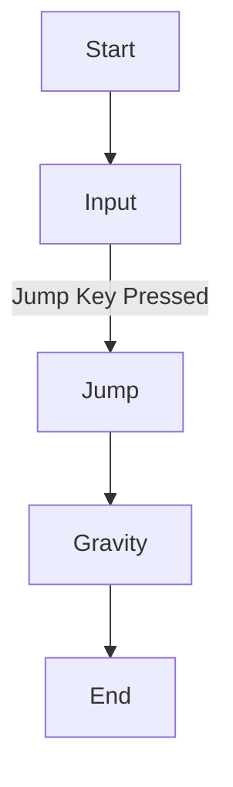

# Lab - Presenting Project Work Professionally in Markdown on GitHub

*In this lab, you’ll learn how to create a clean, professional project report using **Markdown** on GitHub. You'll practice formatting text, adding multimedia, and organizing your report using headings, tables, code blocks, and flowcharts.*


---

### **Core Concept: Markdown for Project Documentation**

Markdown is a lightweight markup language that makes it easy to format text and share documents. On GitHub, it powers project README files, wikis, and documentation. Your game projects will be submitted with a markdown `.md` file that acts as your **project report**.

A well-structured report helps you communicate:
- Your **design process**
- Your **implementation decisions**
- Your **code and challenges**
- **Screenshots, gifs, or videos** of your work

---

## Section 1 - Markdown Essentials

### Step 1: Headings and Structure

Use headings to create a hierarchy and organize your document.  
Markdown supports six levels of headings using `#`:

```markdown
# Main Title
## Section Title
### Subsection Title
#### Sub-subsection (rarely used)
```

> #### ✅ Exercise
> Open a new markdown file and create a structure for your project:
> - Project Title
> - Introduction
> - Features
> - Screenshots/Gifs
> - Code Snippets
> - Development Notes
> - Credits

---

### Step 2: Emphasis, Quotes, and Lists

Format your text for clarity.

```markdown
*italic* or _italic_  
**bold** or __bold__  
> This is a block quote used for callouts or citations.
- Bullet list item
1. Numbered list item
```

> #### ✅ Exercise
> Create a short paragraph using:
> - Italics and bold
> - A block quote
> - A bullet and numbered list

---

### Step 3: Code Blocks (Unformatted and C#)

Markdown supports **inline** code with backticks and **code blocks** with triple backticks.

```markdown
Inline example: `Vector3.MoveTowards()`

C# example:
```csharp
void Jump()
{
    if (isGrounded)
        rb.velocity = new Vector2(rb.velocity.x, jumpForce);
}
```
```

> #### ✅ Exercise
> Paste a short piece of code from your game (e.g., movement or input) and format it correctly in markdown.

---

### Step 4: Tables

Tables are great for comparisons, tracking features, or bug status.

```markdown
| Feature         | Implemented | Notes              |
|-----------------|-------------|--------------------|
| Player Jump     | ✅           | Works as expected  |
| Enemy AI        | ❌           | In progress        |
```

> #### ✅ Exercise
> Create a table summarizing features in your game.

---

### Step 5: Embedding Media (Images and GIFs)

To embed images or gifs:

```markdown

```

GitHub will automatically show these if your files are in the same repo.

> #### ✅ Exercise
> Add at least one image or gif to your markdown file. (This can be a placeholder for now.)

---

### Step 6: Flowcharts and Diagrams (with Mermaid)

GitHub supports **Mermaid.js**, which lets you draw flowcharts and diagrams using code blocks.

**Important**: You must wrap your diagram in a ` ```mermaid ` code block.

```markdown

```

> #### ✅ Exercise
> Use Mermaid to sketch a basic logic flow of a mechanic (e.g., jumping, enemy AI).

---

## Section 2 - Project Report Template

Copy this structure into your own markdown file (`ProjectReport.md`):

```markdown
# Project Title

## 🎮 Introduction
A short paragraph explaining your project idea.

## ✨ Features
- [x] Implemented feature 1
- [ ] Planned feature 2

## 🧠 Game Logic
```csharp
// Paste key snippets of your game logic here
```

## 📸 Media


## 🔍 Development Notes
> What went well?
> What was difficult?
> What would you change next time?

## 🙌 Credits
- Code: Me
- Art: Kenney.nl
```

---

## Section 3 - Submitting via GitHub

1. Create a **GitHub repository** for your project.
2. Add your Unity project files.
3. Add your `ProjectReport.md` file in the root.
4. Push to GitHub and check how it looks in the browser.

> ✅ **Checklist**
> - [ ] Headings used
> - [ ] Code blocks included
> - [ ] Images or gifs embedded
> - [ ] Table used
> - [ ] Clear project summary

---

## Summary

✅ Learned how to use **Markdown** for structured project reports  
✅ Practiced formatting **headings, code, tables, and flowcharts**  
✅ Created a professional **project template** for GitHub submission  
✅ Embedded **multimedia** and documented your **design thinking**
